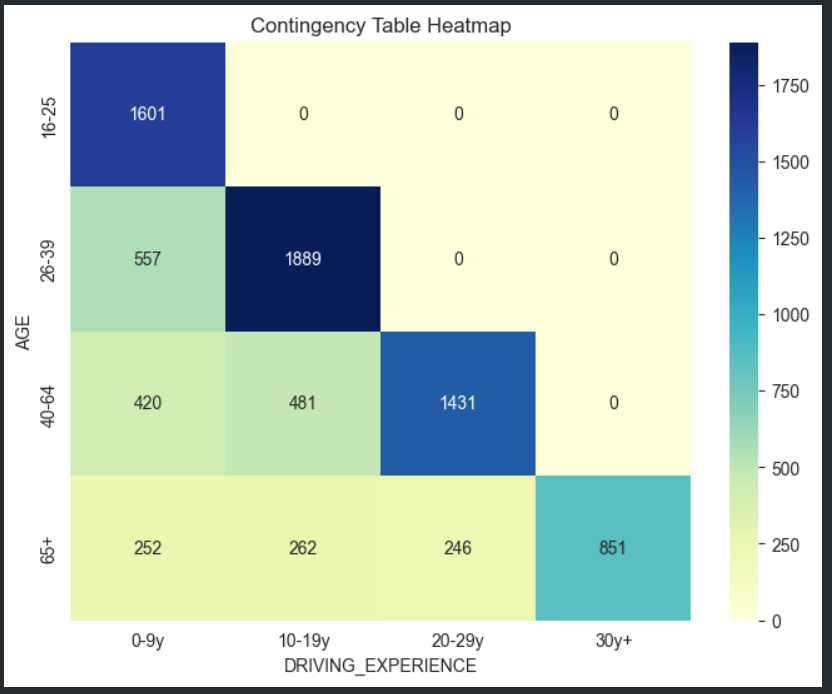
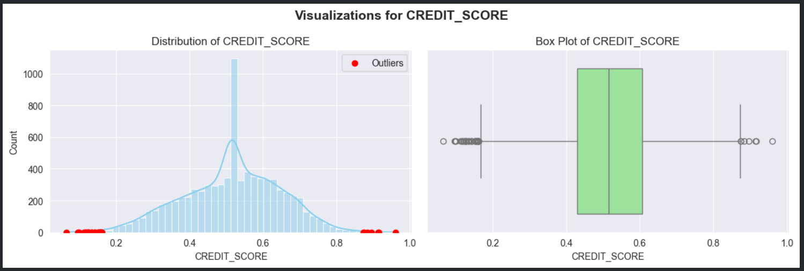

# 🚗 Car Insurance Claims - Exploratory Data Analysis (EDA)

This repository presents a comprehensive **Exploratory Data Analysis (EDA)** of the **Car Insurance Claims dataset**.  
The objective is to explore customer demographics, driving behavior, and vehicle details in order to understand the key factors influencing **insurance claim outcomes**.

---

## 📂 Dataset
Source: [Kaggle - Car Insurance Data](https://www.kaggle.com/datasets/sagnik1511/car-insurance-data)

### Main Features
- **Demographics:** AGE, GENDER, RACE, MARRIED, CHILDREN  
- **Socio-Economic:** EDUCATION, INCOME, CREDIT_SCORE  
- **Driving History:** DRIVING_EXPERIENCE, SPEEDING_VIOLATIONS, DUIS, PAST_ACCIDENTS  
- **Vehicle Info:** VEHICLE_YEAR, VEHICLE_TYPE, VEHICLE_OWNERSHIP, ANNUAL_MILEAGE  
- **Target Variable:** OUTCOME (Approved / Rejected / Pending)

---

## 🔎 Methodology
The analysis follows a structured workflow:

1. **Data Understanding & Cleaning**  
   - Inspected dataset structure and variable distributions  
   - Identified missing values  
   - Since the columns with missing values had **no significant correlation with other features**,  
     we applied **mean imputation** to ensure pipeline compatibility  
   - Standardized data types and categories  

2. **Outlier Detection & Treatment**  
   - Applied **Z-score clipping** for near-normal distributions  
   - Applied **IQR clipping** for skewed distributions  
   - Preserved meaningful outliers to maintain data integrity  

3. **Exploratory Visualization**  
   - Distribution plots for demographic and vehicle-related features  
   - Correlation analysis (Spearman) between numerical attributes  
   - Heatmaps and boxplots for insights  

---

## 📊 Key Insights
- A **positive correlation** exists between **Past Accidents** and **Speeding Violations**  
- A **negative correlation** is observed between **Annual Mileage** and **Number of Children**  
- Columns with missing values were **independent of other features**, making **mean imputation** the most reliable option  
- Dataset is dominated by **young drivers with regular cars**, mostly from a **single location**, which may affect generalizability  

---

## 🖼️ Visualizations

### Contingency Table  

### Histogram & Box Plot  

---

## 🛠️ Tools & Libraries
- **Python**: Pandas, NumPy  
- **Visualization**: Matplotlib, Seaborn  
- **Missing Data Handling**: Missingno  

---

## 📌 Conclusion
- Minimal missing data was handled with **mean imputation** due to lack of correlation with other features  
- Outliers were clipped using Z-score and IQR to retain realistic values  
- Several meaningful relationships were identified, which can support **predictive modeling** and **risk assessment** in insurance  

---

## 🚀 Next Steps
- Feature engineering and encoding of categorical variables  
- Development of ML models to predict **claim outcomes**  
- Comparative analysis of classification algorithms (Logistic Regression, Random Forest, etc.)  

---

## 📒 Notebook
The full analysis is available in the Jupyter Notebook:  
👉 [Car_Insurance_Claims_EDA Notebook](notebooks/notebook.ipynb)